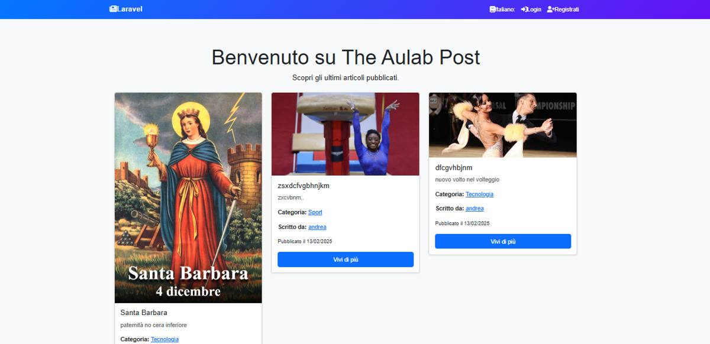
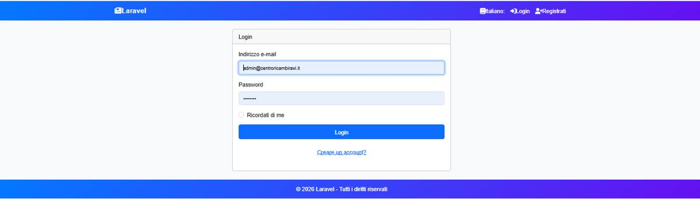
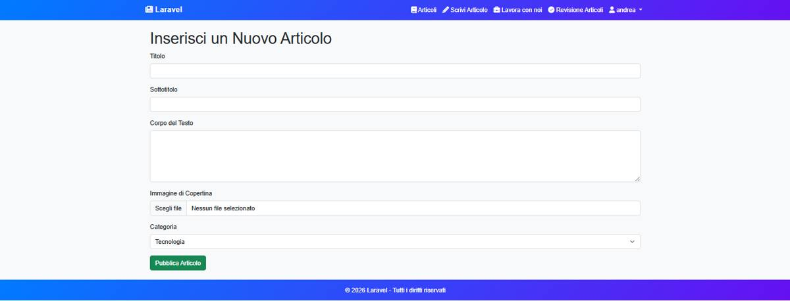
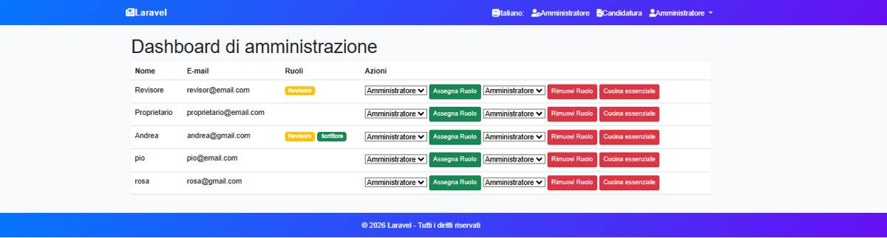
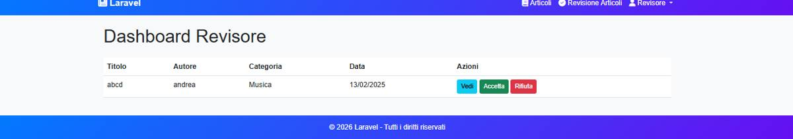

# Aulab Post


**Aulab Post** è una piattaforma web editoriale sviluppata in **Laravel** come progetto finale del percorso Hackademy/Aulab.

L'applicazione simula un portale di pubblicazione articoli con autenticazione, ruoli autorizzativi, dashboard dedicate, sistema di revisione dei contenuti e gestione candidature.

---

## Screenshot

### Homepage



### Login



### Creazione articolo



### Dashboard amministratore



### Dashboard revisore



### Dettaglio articolo


---

## Highlights

- Autenticazione utenti tramite Laravel Fortify.
- Gestione articoli con creazione, dettaglio, modifica ed eliminazione.
- Sistema di revisione con accettazione o rifiuto dei contenuti.
- Dashboard amministratore per utenti, ruoli e candidature.
- Dashboard revisore per moderazione articoli.
- Ruoli multipli: Admin, Revisor, Writer, Owner e utente registrato.
- Middleware dedicati per proteggere le aree riservate.
- Sezione “Lavora con noi” con gestione candidature.

---

## Obiettivo del progetto

Il progetto nasce per mettere in pratica le competenze acquisite nello sviluppo full stack con Laravel, realizzando un'applicazione completa e strutturata secondo il pattern MVC.

Aulab Post non è solo un esercizio CRUD: include un flusso editoriale con utenti, ruoli, revisione contenuti e pannelli di gestione differenziati.

---

## Workflow articoli

```text
Writer crea articolo
        ↓
Articolo in attesa di revisione
        ↓
Revisor accetta o rifiuta
        ↓
Articolo pubblicato oppure respinto
```

---

## Architettura logica

```text
Browser
  ↓
Laravel Routes
  ↓
Controllers
  ↓
Models / Middleware
  ↓
Database MySQL
```

---

## Tecnologie utilizzate

- PHP 8.2+
- Laravel 11
- Laravel Fortify
- MySQL
- Blade
- Vite
- Tailwind CSS
- JavaScript
- Composer
- NPM

---

## Struttura tecnica

```text
app/
├── Http/
│   ├── Controllers/
│   └── Middleware/
├── Models/

database/
├── migrations/

resources/
├── views/

routes/
└── web.php
```

---

## Ruoli gestiti

- **Admin**: gestione utenti, ruoli e candidature.
- **Revisor**: revisione e moderazione articoli.
- **Writer**: creazione, modifica ed eliminazione dei propri articoli.
- **Owner**: gestione avanzata delle candidature.
- **Utente registrato**: accesso alle funzionalità base e candidatura.

---

## Installazione locale

Clonare il repository e spostarsi nella cartella del progetto:

```bash
git clone https://github.com/andrea-bartiromo/aulab_post.git
cd aulab_post
```

Installare le dipendenze PHP:

```bash
composer install
```

Installare le dipendenze frontend:

```bash
npm install
```

Creare il file `.env` a partire dall'esempio:

```bash
cp .env.example .env
```

Generare la chiave applicativa:

```bash
php artisan key:generate
```

Configurare il database nel file `.env`. Il progetto utilizza MySQL: creare un database locale e impostare le variabili seguenti:

```env
DB_CONNECTION=mysql
DB_HOST=127.0.0.1
DB_PORT=3306
DB_DATABASE=aulab_post
DB_USERNAME=root
DB_PASSWORD=
```

Eseguire migrazioni e seeder demo (utenti e categorie):

```bash
php artisan migrate:fresh --seed
```

Creare il collegamento simbolico per lo storage pubblico:

```bash
php artisan storage:link
```

Avviare Vite in un terminale:

```bash
npm run dev
```

Avviare il server Laravel in un secondo terminale:

```bash
php artisan serve
```

L'applicazione sarà raggiungibile su `http://127.0.0.1:8000`.

---

## Utenti demo

Il comando `php artisan migrate:fresh --seed` crea automaticamente quattro utenti di prova tramite `DemoUserSeeder`, oltre alle categorie iniziali (`CategorySeeder`).

| Ruolo | Email | Password |
|-------|-------|----------|
| Admin | admin@aulabpost.test | password |
| Revisor | revisor@aulabpost.test | password |
| Writer | writer@aulabpost.test | password |
| Owner | owner@aulabpost.test | password |

**Attenzione:** queste credenziali sono destinate esclusivamente all'ambiente locale/demo. Non utilizzarle in produzione né riutilizzare la stessa password su ambienti reali.

---

## Verifica installazione

Dopo aver completato i passaggi precedenti, verificare che:

- la **homepage** sia raggiungibile su `http://127.0.0.1:8000`;
- il **login** funzioni su `/login` con le credenziali demo;
- l'accesso alle **dashboard** sia coerente con il ruolo dell'utente autenticato:
  - Admin → `/admin/dashboard`
  - Revisor → `/revisor/dashboard`
  - Owner → `/owner/dashboard`
  - Writer → creazione articoli su `/articles/create`
- il **database** contenga le categorie demo (Tecnologia, Sport, Musica, Cultura, Cucina) e i quattro utenti elencati sopra.

---

## Documentazione tecnica

È presente anche una documentazione dedicata all'architettura:

[docs/ARCHITECTURE.md](docs/ARCHITECTURE.md)

---

## Stato del progetto

Il progetto è funzionante in ambiente locale ed è stato sviluppato a scopo formativo come progetto finale del percorso Hackademy/Aulab.

---

## Miglioramenti futuri

- Migliorare la UI delle dashboard.
- Aggiungere test automatici.
- Aggiungere deploy dimostrativo.

---

## Autore

**Andrea Bartiromo**  
GitHub: [andrea-bartiromo](https://github.com/andrea-bartiromo)
